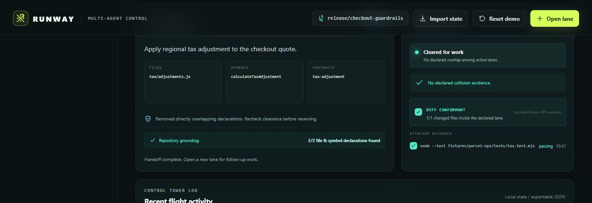

# Runway

> Declare before code. Prove the diff after.

Runway gives parallel Codex agents a code-scope contract. Each agent declares the files, exported symbols, and behavioral contracts it expects to change. Runway grounds that declaration in a repository scan, explains collisions with exact evidence, and either clears, cautions, or holds the work lane. Before handoff, the CLI compares the actual Git changed-file set with the declaration and blocks scope drift.

Runway is entered in the **Developer Tools** track of OpenAI Build Week.

[**Open the live judge demo**](https://vivekyarra.github.io/runway/) · [View the verified deployment](https://github.com/vivekyarra/runway/actions/workflows/pages.yml)

## Judge this build in 90 seconds

The fastest path is the [public hosted demo](https://vivekyarra.github.io/runway/). No account, API key, install, or rebuild is required.

For the local fallback, only Node.js 20.19+ is required:

~~~powershell
git clone https://github.com/vivekyarra/runway.git
cd runway\web
node bin\demo-server.mjs
~~~

Open [http://127.0.0.1:4174](http://127.0.0.1:4174), then follow the **45-second judge demo**:

1. See Tax held before editing because it duplicates Pricing at `src/quote.js`, `quoteTotal`, and the `pricing` contract.
2. Choose **Reroute held lane**. Runway removes the owned overlap and rechecks the declaration.
3. Choose **Reserve clear lane**. The isolated tax-adjustment lane becomes airborne.
4. Choose **Audit changed files**. The labeled fixture diff must stay inside the declared file boundary.
5. Choose **Create verified handoff**. The receipt preserves declared scope, diff conformance, and observed test evidence.

The dashboard also shows a non-blocking repository dependency warning: Checkout imports Pricing's file even though their declarations do not directly overlap. That is the difference between a transparent review signal and a hard hold.

## The problem

Git worktrees isolate *where* agents edit. Merge tools react *after* code diverges. File claims help once a path is touched. None answers the earlier and cheaper question:

> Before two agents start, do they intend to change the same behavior?

Files alone are not enough. Two agents can touch different paths while changing the same contract; two declarations can also be file-disjoint but connected by a real import. Runway makes that risk visible while rerouting is still cheap.

## What works today

- **Pre-edit clearance:** deterministic scoring over exact files, case-sensitive exported symbols, behavioral contracts, module proximity, and scanned one-hop relative imports.
- **Repository grounding:** a persisted JS/TS scan reports which declared files and symbols exist and names anything unknown.
- **Explainable decisions:** every hold or caution carries the file, symbol, contract, or dependency edge that caused it.
- **Actual-diff conformance:** the CLI reads staged, unstaged, and untracked Git paths, names undeclared changed files, and requires a current passing audit before handoff.
- **Safe lane lifecycle:** declare, inspect, reserve, reroute, audit, and create an evidence-backed handoff; invalid transitions and stale audits are rejected.
- **Concurrent local state:** CLI writers use an exclusive local lock, reload under lock, then atomically replace `.runway/state.json`.
- **Codex-native workflow:** the bundled skill instructs an agent to declare before editing, honor holds, verify real work, and hand off.
- **Portable product demo:** checked-in static assets, fixture source, and tests run without credentials or a network service.
- **State bridge:** export the dashboard scenario or import a real `.runway/state.json` into the browser for inspection.

## How clearance works

| Signal | Example | Decision weight |
|---|---|---|
| Exact declared file | both lanes name `src/quote.js` | blocking evidence |
| Exact exported symbol | both lanes name `quoteTotal` | blocking evidence |
| Behavioral contract | both lanes name `pricing` | blocking evidence |
| Same module area | two files under `src/billing/` | non-blocking caution |
| Scanned relative import | `CheckoutForm.jsx -> quote.js` | non-blocking repository caution |

An established airborne owner is protected. A later lane with critical or high direct overlap is held. Low-proximity and dependency signals ask for review without pretending that an import proves incompatible intent.

## Dashboard development path

~~~powershell
cd web
npm ci
npm run dev
~~~

The dashboard is browser-local and never runs shell commands. The bundled scenario includes test evidence recorded from the fixture; use the CLI to create evidence from commands you run yourself. To inspect a CLI-created state, choose **Import state** and select the target repository's `.runway/state.json`.

After changing dashboard source, rebuild the checked-in judge demo with:

~~~powershell
npm run package:demo
~~~

## Real CLI workflow

All product state stays under the target repository's `.runway` folder.

~~~powershell
# From this repository's web folder, initialize the bundled scenario.
node bin\runway.mjs init --root fixtures\parcel-ops --demo

# Persist the real JS/TS inventory. The JSON response says persisted: true.
node bin\runway.mjs scan --root fixtures\parcel-ops --write
node bin\runway.mjs status --root fixtures\parcel-ops

# Tax begins held. Narrow it away from Pricing and request clearance again.
node bin\runway.mjs lane reroute --root fixtures\parcel-ops --id tax-adjustment --files "src/tax/adjustments.js" --symbols "calculateTaxAdjustment" --contracts "tax-adjustment"
node bin\runway.mjs lane reserve --root fixtures\parcel-ops --id tax-adjustment

# Run the evidence command yourself before recording its result.
node --test fixtures\parcel-ops\tests\tax.test.mjs
node bin\runway.mjs lane audit --root fixtures\parcel-ops --id tax-adjustment
node bin\runway.mjs lane handoff --root fixtures\parcel-ops --id tax-adjustment --evidence "node --test fixtures/parcel-ops/tests/tax.test.mjs" --result "passing" --note "Tax adjustment path verified after reroute."
~~~

A lane must declare at least one file, symbol, or contract, and a handoff additionally requires a declared file boundary. Run the audit in a dedicated clean worktree: it reads the current staged, unstaged, and untracked paths and ignores `.runway`. Runway records the verification supplied by the operator; it does not falsely claim to have run that command.

### Local write protocol

Mutating commands cooperate through `.runway/state.lock`. A writer obtains an exclusive local lock, reloads state while holding it, writes a temporary file in the same directory, and atomically replaces `state.json`. Tests cover concurrent lane creation, duplicate IDs, and dead stale-lock recovery.

This is a local-filesystem coordination protocol, not a security boundary or distributed lock. Do not treat it as an SMB/NFS guarantee or protection from a process that ignores the protocol.

## Install the Codex skill

~~~powershell
cd web
$runwayCheckout = (Resolve-Path .).Path
$skillsRoot = Join-Path ([Environment]::GetFolderPath('UserProfile')) '.codex\skills'
New-Item -ItemType Directory -Force -Path $skillsRoot | Out-Null
Copy-Item -Recurse -Force (Join-Path $runwayCheckout 'skills\runway') (Join-Path $skillsRoot 'runway')

# Set this in each coordinating Codex session.
$env:RUNWAY_CLI = Join-Path $runwayCheckout 'bin\runway.mjs'
~~~

Start a new Codex session after installation so the skill is discovered. The skill calls the local CLI and needs no runtime API key.

## Verify the product

~~~powershell
cd web
npm ci
npm test
npm run lint
npm run build
npm run package:demo
~~~

The current suite has 27 tests covering the fixture, collision model, repository grounding, dependency evidence, actual Git diff conformance, file-boundary, stale-audit and handoff guards, concurrent writers, and stale-lock recovery.

## Architecture

~~~text
Codex agent -> runway skill -> dependency-free Node CLI -> .runway/state.json
                                  |                         |
                                  |                         +-> atomic local state + receipts
                                  +-> JS/TS scan ---------->+-> grounding + import edges
                                  +-> declared scope ------>+-> clear / caution / hold
                                  +-> actual Git paths ---->+-> conformant / scope drift

React dashboard -> same collision core -> guided demo + JSON import/export
Bundled fixture  -> real source/tests  -> reproducible evidence
~~~

The collision core is shared by the CLI and React dashboard. The static demo is generated from the same source, so the presentation is not a disconnected mockup.

## Why Runway is different

General agent control planes route work. Runway controls one narrower failure boundary: **planned code scope versus actual changed code**. Its unit is a two-sided code-scope contract:

- declared before implementation and checked against the Git changed-file set before handoff;
- richer than a file lock because it names symbols and behavioral contracts;
- more honest than opaque “AI confidence” because the evidence and scoring are inspectable;
- complementary to Git, worktrees, tests, and review rather than a replacement for them.

## Honest boundaries

Runway is a cooperative local advisory layer. The diff audit catches undeclared changed paths, but it does not prevent writes, stop a process from ignoring the protocol, or prove that edits inside an allowed file match the declared symbol or contract. The scanner recognizes common JS/TS exports, imports, and routes; it is not a compiler or whole-program analyzer. A caution does not prove a collision, and clearance does not guarantee a conflict-free merge. The dashboard does not monitor agents or execute Git or test commands; its guided flow uses a clearly labeled fixture diff snapshot.

These boundaries are deliberate: a judge can reproduce every product decision without trusting a hidden model call.

## Codex and GPT-5.6 collaboration

Codex with GPT-5.6-terra accelerated the project from product selection through adversarial verification:

- **Product:** narrowed the product from general orchestration to one testable boundary: declared scope versus actual changed files.
- **Engineering:** implemented the shared collision core, CLI, repository scan, Git diff audit, atomic local write protocol, transition guards, and JSON state bridge.
- **Design:** shaped the collision -> reroute -> reserve -> diff audit -> handoff story into a guided judge flow.
- **QA:** found and fixed Windows path normalization, symbol-case, ownership-order, unscoped-lane, concurrent-write, stale-lock, and claim-accuracy defects; added regression tests.

The core-build session of record is `019f6e9b-8401-78c0-a71b-56273ec52b3f`, authenticated as `gpt-5.6-terra`. [03_build_log.md](03_build_log.md) records decisions, validation evidence, and remaining risks. [SUBMISSION.md](SUBMISSION.md) contains final Devpost copy, the exact video script, and the account-bound checklist.

## License

MIT. See [LICENSE](LICENSE).
