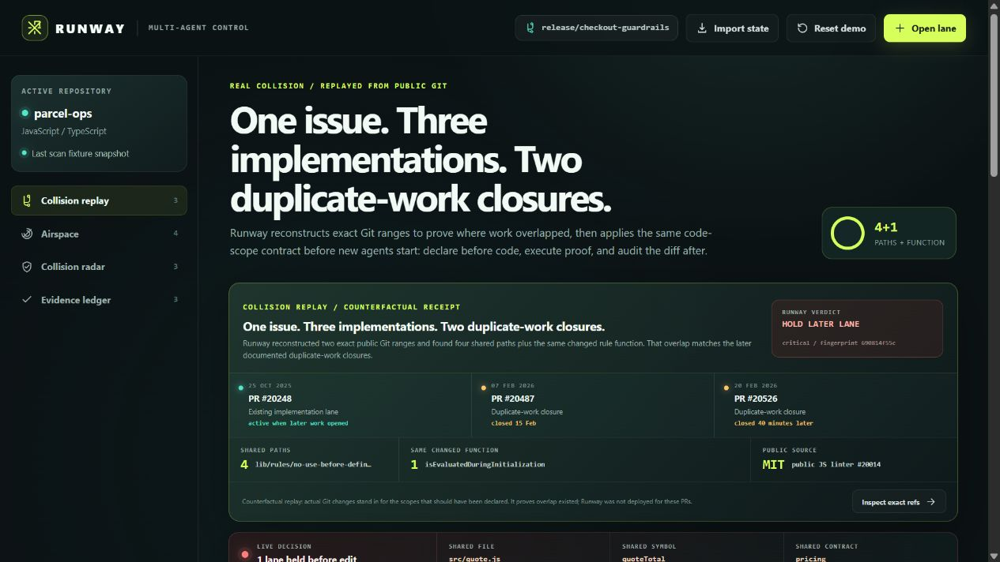
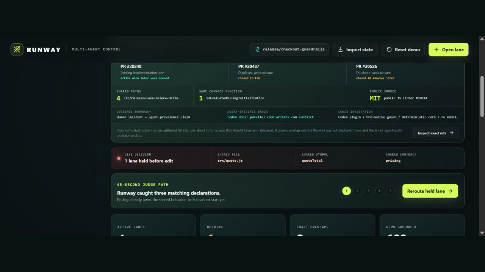

# Runway

> Declare before code. Block out-of-lane patches. Prove the handoff.

Two coding agents can edit different files and still implement the same behavior. Git reports the damage after both have written code. Runway compares planned files, exported symbols, and behavioral contracts before work starts, protects the established owner, and now uses a native Codex `PreToolUse` hook to reject direct patches outside the reserved lane. A Runway-executed command and fresh Git audit verify the result afterward.

The evidence stays honest. One public ESLint issue produced three independent **human** implementations; two later pull requests were closed to avoid duplicating work. The replay proves a real failure shape, not agent prevalence. [Official Codex guidance](https://learn.chatgpt.com/docs/agent-configuration/subagents) separately warns that parallel write-heavy agent workflows can create conflicts and coordination overhead.

Runway is an OpenAI Build Week **Developer Tools** project.

[**Open the live judge demo**](https://vivekyarra.github.io/runway/) | [Inspect the replay artifact](docs/replays/eslint-20014.json) | [See deployment verification](https://github.com/vivekyarra/runway/actions/workflows/pages.yml)

## Judge it in 90 seconds

Open the [hosted demo](https://vivekyarra.github.io/runway/). No account, API key, install, or rebuild is required.

1. Read the collision replay: exact public Git ranges, four shared paths, and the shared `isEvaluatedDuringInitialization` function.
2. Expand **Inspect exact refs + receipt**. The source links, commit SHAs, disclosure, and artifact fingerprint are inspectable.
3. Continue to the live prevention flow. Tax is held before editing because Pricing already owns the same file, symbol, and contract.
4. Inspect the native Codex plugin below: its trusted `PreToolUse` hook denies direct patches outside the bound airborne lane.
5. Reroute, reserve, inspect the fixture diff, and create the browser fixture receipt.
6. Use the CLI path below for the real proof: Runway executes the trusted test command itself, then audits Git before it creates a handoff.

The browser is an interactive, deterministic fixture. It never claims to run Git or shell commands. The CLI is the executable product path.

## The problem

Parallel coding agents can independently implement the same behavior, even in different files. Worktrees isolate edit locations. Git and merge tools react after code exists. Task routers assign work, but they do not necessarily compare intended code scope. The cheap intervention point is earlier:

> Before two agents start, do they intend to change the same behavior?

Files alone are not enough. Two lanes can name different paths while changing the same exported symbol or behavioral contract. Runway makes that intent inspectable before work and checks the actual changed-file set afterward.

## Evidence ladder

| Layer | Checkable evidence | What it establishes |
|---|---|---|
| Observed failure | Exact public human-authored Git ranges and two documented duplicate-work closures | Duplicate implementation is real and reconstructable at file/function scope |
| Agent-specific basis | [OpenAI's Codex documentation](https://learn.chatgpt.com/docs/agent-configuration/subagents) says parallel write-heavy agents can create conflicts and coordination overhead | The same coordination boundary exists in supported parallel-agent workflows |
| Runway mechanism | Live declared-scope hold, native Codex patch guard, Runway-executed proof, and post-command Git audit | This build can stop supported out-of-lane patch calls and reject remaining changed-file drift |
| Not claimed | No production telemetry or adoption study | Agent-collision prevalence and impact at scale remain unmeasured |

## The differentiator: Collision Replay

Runway can turn two historical Git ranges into a provenance-backed counterfactual:

- resolves both ranges to exact commit SHAs;
- extracts changed JavaScript/TypeScript paths and changed declaration lines;
- feeds those scopes through the same deterministic collision engine used by live lanes;
- emits exact overlap evidence and a SHA-256-fingerprinted JSON artifact;
- verifies the artifact has not changed since its published fingerprint was computed.

The checked-in replay uses public history from ESLint PRs [#20248](https://github.com/eslint/eslint/pull/20248) and [#20487](https://github.com/eslint/eslint/pull/20487). PR #20487 was closed to avoid duplicating the earlier work; a third implementation, [#20526](https://github.com/eslint/eslint/pull/20526), was also closed as duplicate work. Runway was not deployed there, and those contributors were human. Historical diffs stand in for the scopes that should have been declared, so the result proves overlap and demonstrates what Runway *would* have held—not agent prevalence or historical causality.

Verify the published artifact from `web`:

~~~powershell
node bin\runway.mjs replay verify --file ..\docs\replays\eslint-20014.json
~~~

Published artifact SHA-256:

~~~text
690814f55c81bd9b3c0224f53cbe827551c82287c1e93d55c65c72c7d92e8d9e
~~~

### Reproduce the replay from public Git refs

This creates a separate repository under the system temp directory. It does not modify the Runway checkout.

~~~powershell
cd web
$replayRoot = Join-Path ([IO.Path]::GetTempPath()) ("runway-eslint-replay-" + (Get-Date -Format 'yyyyMMdd-HHmmss'))
git init $replayRoot
git -C $replayRoot remote add origin https://github.com/eslint/eslint.git
git -C $replayRoot fetch --depth=1 origin aeed0078ca2f73d4744cc522102178d45b5be64e:refs/runway/base-20248 pull/20248/head:refs/runway/pr-20248
git -C $replayRoot fetch --depth=1 origin 8330d238ae6adb68bb6a1c9381e38cfedd990d94:refs/runway/base-20487 pull/20487/head:refs/runway/pr-20487

node bin\runway.mjs replay `
  --root $replayRoot `
  --left "refs/runway/base-20248..refs/runway/pr-20248" `
  --left-label "PR #20248" `
  --left-task "Fix self-referential initializer handling" `
  --left-url "https://github.com/eslint/eslint/pull/20248" `
  --left-created-at "2025-10-25T17:46:34Z" `
  --right "refs/runway/base-20487..refs/runway/pr-20487" `
  --right-label "PR #20487" `
  --right-task "Add deferred-reference option" `
  --right-url "https://github.com/eslint/eslint/pull/20487" `
  --right-created-at "2026-02-07T18:39:24Z" `
  --source-url "https://github.com/eslint/eslint" `
  --source-license MIT `
  --out (Join-Path $replayRoot 'replay.json')

node bin\runway.mjs replay verify --file (Join-Path $replayRoot 'replay.json')
~~~

The source repository is MIT licensed. Runway is not affiliated with or endorsed by ESLint; see [the replay notice](docs/replays/NOTICE.md).

## What works today

- **Historical collision replay:** exact Git refs become inspectable changed-path and changed-function overlap evidence.
- **Pre-edit clearance:** exact files, case-sensitive exported symbols, behavioral contracts, module proximity, and one-hop relative imports produce clear, caution, protected-owner, or hold decisions.
- **Native Codex patch guard:** the installable plugin's trusted `PreToolUse` hook rejects direct `apply_patch`/`Edit`/`Write` targets outside the `RUNWAY_LANE` file boundary.
- **Repository grounding:** a persisted JS/TS scan identifies declared files and symbols that exist and names unknown declarations.
- **Explainable decisions:** every hold or caution names the path, symbol, contract, or dependency edge that caused it.
- **Runway-executed proof:** `lane verify` runs the exact trusted command, captures exit status, timing, output hashes, and byte counts, then performs a fresh Git audit.
- **Actual-diff conformance:** staged, unstaged, and untracked paths are compared with the declared file boundary after the command runs.
- **Guarded handoff:** only a successful command plus a conformant post-command audit creates a receipt. Manual passing handoffs are rejected.
- **Concurrent local state:** writers use an exclusive local lock, reload under lock, and atomically replace `.runway/state.json`.
- **Installable Codex workflow:** a repository marketplace packages the auto-discovered skill, patch guard, and standalone dependency-free CLI.
- **Portable demo:** checked-in static assets, fixture source, and tests run without credentials or a hosted backend.

## Install the Codex plugin

Requirements: Codex with plugin and lifecycle-hook support, Node.js 20.19+, and Git. The browser demo works in modern desktop browsers. The plugin and CLI are tested on Windows and Linux CI; macOS is expected to work through the documented POSIX hook command but is not part of CI.

Add this public repository as a marketplace, then install Runway:

~~~powershell
codex plugin marketplace add vivekyarra/runway --ref main
codex plugin add runway@runway-marketplace
~~~

Start a new Codex thread in the target repository. Run `/skills` to confirm `runway`, then `/hooks` to inspect and trust the bundled hook. Bind one lane ID to each Codex process before launch:

~~~powershell
$env:RUNWAY_LANE = 'tax-adjustment'
codex
~~~

On macOS or Linux:

~~~bash
RUNWAY_LANE=tax-adjustment codex
~~~

Invoke `$runway`, or ask Codex to coordinate the task with Runway. The skill resolves the plugin's bundled CLI; no separate npm install or rebuild is required. Until a repository contains `.runway/state.json`, the guard is inert. Once initialized, direct Codex patch calls fail closed when the lane is missing, unknown, not airborne, or targets an undeclared file.

To remove it:

~~~powershell
codex plugin remove runway@runway-marketplace
codex plugin marketplace remove runway-marketplace
~~~

## Run locally

Only Node.js 20.19+ is required for the no-rebuild demo:

~~~powershell
git clone https://github.com/vivekyarra/runway.git
cd runway\web
node bin\demo-server.mjs
~~~

Open [http://127.0.0.1:4174](http://127.0.0.1:4174). The complete sample repository is in `web/fixtures/parcel-ops`; no sample download or API key is needed.

For dashboard development:

~~~powershell
cd web
npm ci
npm run dev
~~~

## Real CLI workflow

Run this in a dedicated clean worktree. `lane verify` executes the exact command string in the target repository, so never pass untrusted command text.

~~~powershell
# From web, prepare the bundled scenario as its own disposable Git repository.
$proofRoot = Join-Path ([IO.Path]::GetTempPath()) ("runway-proof-" + (Get-Date -Format 'yyyyMMdd-HHmmss'))
Copy-Item -Recurse -Force (Resolve-Path 'fixtures\parcel-ops') $proofRoot
git -C $proofRoot init
git -C $proofRoot config user.email 'runway@example.test'
git -C $proofRoot config user.name 'Runway Demo'
git -C $proofRoot add .
git -C $proofRoot commit -m 'fixture baseline'

node bin\runway.mjs init --root $proofRoot
node bin\runway.mjs scan --root $proofRoot --write
node bin\runway.mjs lane create --root $proofRoot --id tax-adjustment --agent "Sol / Rules" --task "Apply regional tax adjustment" --files "src/tax/adjustments.js" --symbols "calculateTaxAdjustment" --contracts "tax-adjustment"
node bin\runway.mjs lane reserve --root $proofRoot --id tax-adjustment
node bin\runway.mjs lane verify --root $proofRoot --id tax-adjustment --command "node --test tests/tax.test.mjs" --note "Focused tax path verified after reroute."
~~~

On success, the JSON receipt includes `source: runway-executed`, the command result and exit code, duration, stdout/stderr SHA-256 hashes, and the post-command Git audit. A failed command, timeout, unexpected file, or lane mutation during execution prevents handoff.

## Verify the product

~~~powershell
cd web
npm ci
npm test
npm run lint
npm run build
npm run package:demo
~~~

The suite has 39 tests covering replay extraction and tamper detection, the collision model, repository grounding, real Git diff conformance, executed proof success/failure/drift, lifecycle guards, concurrent writers, stale-lock recovery, patch-target extraction, allowed and denied hook paths, traversal, installable manifest structure, plugin source parity, and standalone plugin CLI operation.

## Architecture

~~~text
Historical Git ranges -> replay extractor -> shared collision core -> replay artifact

Codex agent -> Runway plugin -> skill -> dependency-free CLI -> .runway/state.json
                    |                          |                    |
                    +-> PreToolUse patch guard |                    +-> atomic state + receipts
                         |                     +-> JS/TS scan ----->+-> grounding + import edges
                         +-> allow / deny      +-> declarations --->+-> clear / caution / hold
                                               +-> trusted command -> test result + output hashes
                                               +-> fresh Git audit -> conformant / scope drift

React dashboard -> same collision core -> guided fixture + JSON import/export
~~~

## Honest boundaries

Runway is a bounded local guardrail. The trusted Codex hook prevents supported direct patch calls outside an airborne lane's declared files, but it does not cover every shell command, hosted tool, MCP implementation, editor, disabled hook, or external process. It cannot stop an agent from declaring too broadly or prove that edits inside an allowed file match the named symbol or contract. The scanner and replay extractor recognize common JS/TS patterns; neither is compiler-grade or whole-program analysis. Import proximity is only a caution. Clearance does not guarantee a conflict-free merge.

The replay is counterfactual, not evidence Runway participated in the historical event. Its SHA-256 fingerprint detects changes relative to the published digest; it is not a digital signature or identity proof. The local lock is not a distributed-filesystem guarantee. The browser demo uses labeled fixture records and does not execute Git or tests.

Those limits are deliberate. Every material decision remains reproducible without trusting a hidden model call.

## Built with Codex and GPT-5.6

**Runway runs inside Codex as a skill, lifecycle hook, and bundled CLI, but does not call GPT-5.6 at runtime.** Collision clearance, patch decisions, artifact verification, command evidence, and Git audits remain deterministic so a judge can reproduce them without a key or hidden model judgment.

GPT-5.6-terra ran through Codex as the engineering environment that built and pressure-tested the product. It helped narrow the problem, implement the shared core, replay extractor, CLI verification gate, dashboard, installable plugin, hook protocol, local concurrency, documentation, and adversarial tests. Its work is checkable in the dated commit trail and build log rather than represented by a decorative API call.

The [Official Rules](https://openai.devpost.com/rules) describe the requirement as building with Codex and GPT-5.6, explaining that collaboration in the README/video, and providing the `/feedback` Codex Session ID. They do not state that the shipped runtime must call a model API. The session of record is `019f6e9b-8401-78c0-a71b-56273ec52b3f`.

[03_build_log.md](03_build_log.md) records the evidence trail. [SUBMISSION.md](SUBMISSION.md) contains the exact Devpost copy, video script, and remaining account-bound checklist.

## License

MIT. See [LICENSE](LICENSE).
